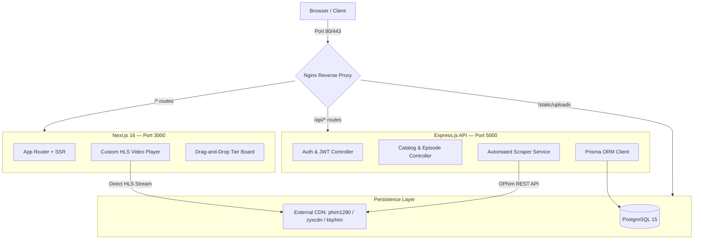

<div align="center">

```text
██████╗  ██████╗ ███╗   ██╗ ██████╗ ██╗  ██╗██╗   ██╗ █████╗ ██████╗ ██████╗ 
██╔══██╗██╔═══██╗████╗  ██║██╔════╝ ██║  ██║██║   ██║██╔══██╗╚════██╗██╔══██╗
██║  ██║██║   ██║██╔██╗ ██║██║  ███╗███████║██║   ██║███████║ █████╔╝██║  ██║
██║  ██║██║   ██║██║╚██╗██║██║   ██║██╔══██║██║   ██║██╔══██║ ╚═══██╗██║  ██║
██████╔╝╚██████╔╝██║ ╚████║╚██████╔╝██║  ██║╚██████╔╝██║  ██║██████╔╝██████╔╝
╚═════╝  ╚═════╝ ╚═╝  ╚═══╝ ╚═════╝ ╚═╝  ╚═╝ ╚═════╝ ╚═╝  ╚═╝╚═════╝ ╚═════╝ 
```

# 🎬 Donghua3D — Premium Chinese 3D Anime Streaming Platform

[](https://github.com/iamnguyenvu/donghua3d-monorepo)
[](https://nextjs.org)
[](https://expressjs.com)
[](https://postgresql.org)
[](https://prisma.io)
[](https://docker.com)
[](https://typescriptlang.org)

**An enterprise-grade, cinematic web streaming platform built for curated Chinese 3D Animation (Donghua).** Engineered from First-Principles to deliver lag-free HLS streaming, drag-and-drop tier lists, reputation-weighted anti-spam ratings, and spoiler-blurred comment trees — all within a Docker-orchestrated TypeScript monorepo.

> 🌐 **Repository**: [github.com/iamnguyenvu/donghua3d-monorepo](https://github.com/iamnguyenvu/donghua3d-monorepo)  
> 🇻🇳 **Tiếng Việt**: Đọc tài liệu tại [README_vi.md](./README_vi.md)

</div>

---

## 📸 Interface Showcases

Live production screenshots of the **Donghua3D** platform:

| 🏠 Cinematic Homepage | 📊 Tier List & Leaderboard |
| :---: | :---: |
|  |  |

| 🎥 Custom HLS Video Player & Watch Experience |
| :---: |
|  |

---

## 💎 Core Platform Features

| Feature | Description |
| :--- | :--- |
| 🎥 **Elite HLS Streaming** | Sub-second startup and seeking via a custom player overlay wrapping `hls.js`, powered by partner CDNs (`phim1280.tv`, `zyxcdn.com`, `kkphimplayer7.com`) |
| 🤖 **Automated Scraper Service** | Admin-controlled sync engine that fetches, cleans, and seeds full movie catalogs from OPhim API — including Hán-Việt title normalization |
| 🛡️ **Dual-Track Anti-Spam Engine** | Reputation-weighted scoring (0–100 scale) with 7-day sandbox rules for new accounts and rate-limit lockdown against review bombing |
| 📊 **Drag-and-Drop Tier Board** | Glassmorphic interface for ranking series (S/A/B/C/D/F) with personal sidecar notes, aggregated into a Global Tier Leaderboard |
| 💬 **Spoiler-Blurred Comment Tree** | Nested comment threads with CSS blur on plot-sensitive content, revealed only on explicit click |
| 💾 **Auto-Resume & Skip Intro** | Throttled watch-progress sync every 10s to the database, with floating skip-intro buttons for OP/ED sequences |
| ⚡ **Nginx Microcaching** | 1-second in-memory cache on all public API routes — blocks DDoS bursts and keeps catalog response times under **5ms** |
| 🔒 **Mutex-Locked Transcoding** | FFmpeg transcoding worker enforces single-concurrency to prevent CPU starvation on the host EC2 instance |

---

## 🏗️ Architecture Overview



---

## 🛠️ Monorepo Structure

```text
donghua3d-monorepo/
├── docs/                              # Spec-Driven Development (SDD) documents
│   ├── 01_system_spec.md              # System scope, bounded contexts, threat model
│   ├── 02_data_spec.md                # PostgreSQL DDL, composite indices, rating math
│   ├── 03_api_spec.md                 # REST API routes, JSON payloads, SSE formats
│   ├── 04_ui_ux_spec.md               # Design tokens, custom player, tier board UX
│   ├── 05_ops_spec.md                 # Dockerfiles, Nginx microcache, CloudFront setup
│   ├── 06_implementation_plan.md      # Chronological task list with verify triggers
│   ├── 07_conventions_spec.md         # Naming, git commits, BEM, Angular commit style
│   ├── 08_audit_report.md             # Initial source code audit & repository assessment
│   ├── 09_current_system_report.md    # Post-Phase 1 state: HLS integration & UI audit
│   ├── 10_phase2_implementation.md    # Phase 2 roadmap: Vidstack, Cloudflare R2, Sockets
│   ├── 11_video_sources_audit.md      # In-depth HLS proxy CDN analysis (hoathinh3d/hh3d)
│   ├── 12_premium_4k_architecture.md  # Hybrid 4K self-hosted R2 stream architecture
│   └── 13_renovation_master_blueprint.md # Master upgrade plan: DB, Scraper, UI overhaul
├── nginx/
│   └── nginx.conf                     # CORS, microcaching, HLS & static file delivery
├── backend/                           # Express.js + TypeScript API Server
│   ├── src/
│   │   ├── controllers/               # Route handlers: auth, movies, episodes, scraper
│   │   ├── services/                  # Business logic: scraper, FFmpeg transcoding
│   │   ├── middleware/                # JWT auth, error handling, rate limiting
│   │   ├── gateways/                  # Socket.IO real-time gateway
│   │   └── scripts/                   # Admin CLI: update-studios, auto-update-episodes
│   ├── prisma/
│   │   ├── schema.prisma              # Full relational schema (Movie, Episode, Rating…)
│   │   ├── migrations/                # Prisma migration history
│   │   └── seed.ts                    # DB seeder with real HLS stream sources
│   └── Dockerfile                     # Multi-stage build with FFmpeg bundled
├── frontend/                          # Next.js 16 + App Router Web Client
│   ├── src/
│   │   ├── app/                       # Page routes: home, movies, leaderboard, profile
│   │   └── components/                # Header, Player, TierBoard, CommentTree, etc.
│   └── Dockerfile                     # Multi-stage standalone Next.js container
├── docker-compose.yml                 # Orchestrates: db, backend, frontend, nginx
├── .env.example                       # Environment secrets template
└── README.md                          # You are here
```

---

## ⚙️ Requirements

| Tool | Version |
| :--- | :--- |
| **Docker & Docker Desktop** | Latest stable (required) |
| **Node.js** | `v20.x` or `v22.x` LTS |
| **FFmpeg** | System PATH (optional — only for local CLI testing outside Docker) |

---

## 🚀 Quick Start

### 1. Clone the repository
```bash
git clone https://github.com/iamnguyenvu/donghua3d-monorepo.git
cd donghua3d-monorepo
```

### 2. Configure environment variables
```bash
cp .env.example .env
# Edit .env with your secrets: DATABASE_URL, JWT_SECRET, etc.
```

### 3. Build & launch all containers
```bash
docker compose up -d --build
```
> Once running, visit **[http://localhost](http://localhost)** — served through the Nginx proxy on port 80.

### 4. Initialize the database (first run only)
```bash
# Run Prisma migrations & seed the catalog
docker compose exec backend npx prisma migrate dev --name init
docker compose exec backend npx prisma db seed
```

### 5. Useful development commands
```bash
# View live container logs
docker compose logs -f

# Open Prisma Studio (DB GUI)
docker compose exec backend npx prisma studio

# Sync a movie from OPhim API (admin script)
docker compose exec backend npm run auto-update

# Rebuild a single service
docker compose up -d --build backend
```

---

## 📡 API Reference Highlights

| Method | Endpoint | Auth | Description |
| :---: | :--- | :---: | :--- |
| `GET` | `/api/movies` | — | List all movies with pagination |
| `GET` | `/api/movies/:id` | — | Get movie details with episodes |
| `GET` | `/api/episodes/:id` | — | Get episode + stream URL (increments viewsCount) |
| `POST` | `/api/auth/register` | — | Register a new user account |
| `POST` | `/api/auth/login` | — | Login and receive JWT token |
| `POST` | `/api/ratings` | 🔐 JWT | Submit a rating (sandbox + reputation check) |
| `GET` | `/api/leaderboard` | — | Global Tier Leaderboard rankings |
| `POST` | `/api/scraper/sync-movie` | 🔐 Admin | Sync a single movie by OPhim slug |
| `POST` | `/api/scraper/sync-latest` | 🔐 Admin | Bulk sync latest movies from OPhim |
| `GET` | `/api/upload/status/:id` | 🔐 Admin | SSE stream: real-time FFmpeg progress |

> Full route contracts, request/response payloads, and SSE event formats are documented in [`03_api_spec.md`](./docs/03_api_spec.md).

---

## 📑 Specification Documents (Claude SDD)

The system is fully specified before any application code is written, following the Claude Spec-Driven Development (SDD) methodology:

| # | Document | Contents |
| :---: | :--- | :--- |
| 01 | [System Spec](./docs/01_system_spec.md) | Scope, technology selections, bounded contexts, threat model |
| 02 | [Data Spec](./docs/02_data_spec.md) | PostgreSQL schemas, composite indices, rating math formulas |
| 03 | [API Spec](./docs/03_api_spec.md) | REST routes, JSON payloads, SSE telemetry formats |
| 04 | [UI/UX Spec](./docs/04_ui_ux_spec.md) | Cinematic design tokens, player controls, tier board interactions |
| 05 | [Ops Spec](./docs/05_ops_spec.md) | Multi-stage Docker, Nginx microcaching, CloudFront / S3 setup |
| 06 | [Implementation Plan](./docs/06_implementation_plan.md) | Chronological task list with explicit verify conditions |
| 07 | [Conventions Spec](./docs/07_conventions_spec.md) | TypeScript style, BEM CSS, Angular semantic git commits |
| 08 | [Audit Report](./docs/08_audit_report.md) | Initial security & quality audit of the source codebase |
| 09 | [Current System Report](./docs/09_current_system_report.md) | Phase 1 completion report: real HLS integration, UI fixes |
| 10 | [Phase 2 Plan](./docs/10_phase2_implementation.md) | Vidstack Player, Cloudflare R2, WebSocket, CI/CD roadmap |
| 11 | [Video Sources Audit](./docs/11_video_sources_audit.md) | HLS proxy CDN deep-dive (hoathinh3d, hh3d, phim1280) |
| 12 | [4K Premium Architecture](./docs/12_premium_4k_architecture.md) | Hybrid external + R2 self-hosted 4K anti-leech architecture |
| 13 | [Renovation Blueprint](./docs/13_renovation_master_blueprint.md) | Master upgrade: DB schema, Scraper refinement, full UI overhaul |

---

## 🤝 Coding Conventions & Contribution

All contributions must comply with **[07_Conventions Spec](./docs/07_conventions_spec.md)**.

### Git Commit Style (Angular Semantic Standard)

```
<type>(<scope>): <short description in lowercase>
```

| Type | When to use |
| :--- | :--- |
| `feat` | New feature or functionality |
| `fix` | Bug fix |
| `docs` | Documentation changes only |
| `style` | Formatting, whitespace — no logic change |
| `refactor` | Code restructuring without behavior change |
| `perf` | Performance improvements |
| `chore` | Build process, dependency updates, CI config |

**Examples:**
```bash
feat(scraper): add hán-việt title normalization map
fix(player): resolve hls.js stall on safari 17
docs(readme): update phase 2 roadmap and api table
perf(nginx): enable microcaching on movie catalog endpoints
```

---

<div align="center">

**Built with ❤️ for the Donghua community**  
*Powered by Next.js · Express.js · PostgreSQL · Prisma · Nginx · Docker*

</div>
