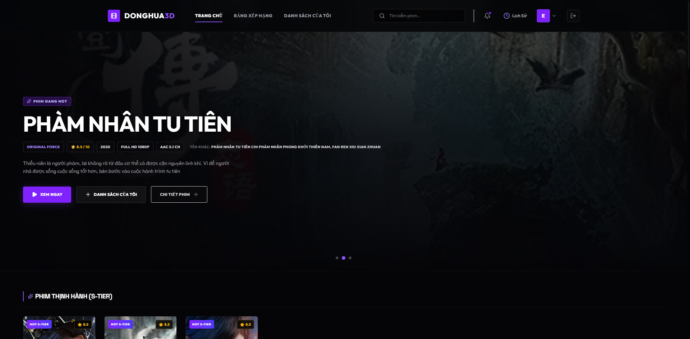
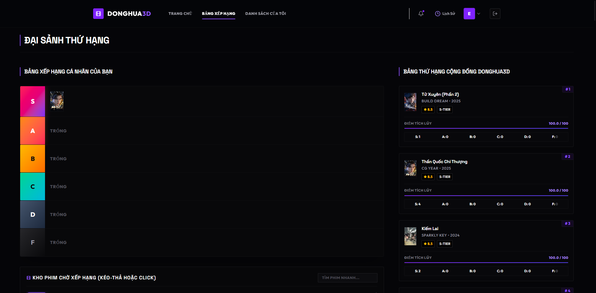
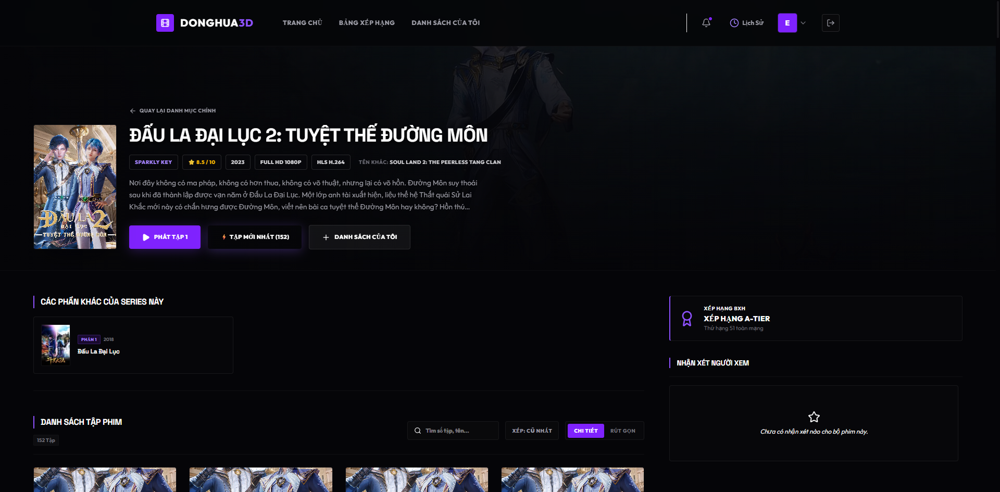
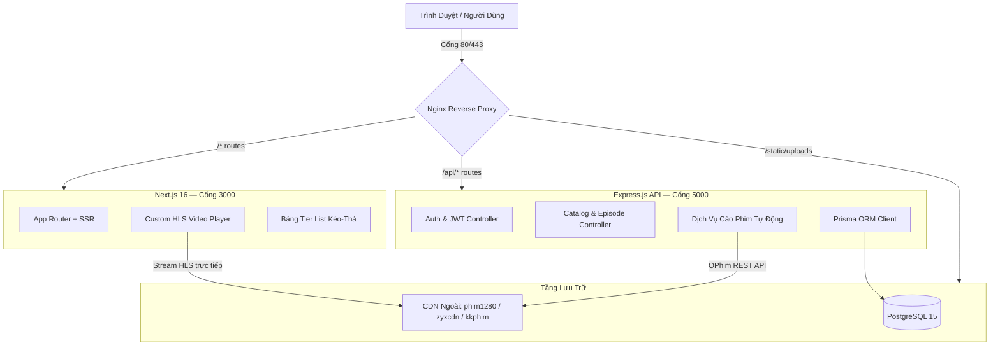

<div align="center">

```text
██████╗  ██████╗ ███╗   ██╗ ██████╗ ██╗  ██╗██╗   ██╗ █████╗ ██████╗ ██████╗ 
██╔══██╗██╔═══██╗████╗  ██║██╔════╝ ██║  ██║██║   ██║██╔══██╗╚════██╗██╔══██╗
██║  ██║██║   ██║██╔██╗ ██║██║  ███╗███████║██║   ██║███████║ █████╔╝██║  ██║
██║  ██║██║   ██║██║╚██╗██║██║   ██║██╔══██║██║   ██║██╔══██║ ╚═══██╗██║  ██║
██████╔╝╚██████╔╝██║ ╚████║╚██████╔╝██║  ██║╚██████╔╝██║  ██║██████╔╝██████╔╝
╚═════╝  ╚═════╝ ╚═╝  ╚═══╝ ╚═════╝ ╚═╝  ╚═╝ ╚═════╝ ╚═╝  ╚═╝╚═════╝ ╚═════╝ 
```

# 🎬 Donghua3D — Nền Tảng Phát Trực Tuyến Phim Hoạt Hình 3D Trung Quốc Cao Cấp

[](https://github.com/iamnguyenvu/donghua3d-monorepo)
[](https://nextjs.org)
[](https://expressjs.com)
[](https://postgresql.org)
[](https://prisma.io)
[](https://docker.com)
[](https://typescriptlang.org)

**Nền tảng phát trực tuyến web đẳng cấp doanh nghiệp, phong cách điện ảnh — được xây dựng riêng cho Phim Hoạt Hình 3D Trung Quốc (Donghua).** Thiết kế từ Nguyên Lý Gốc (First-Principles) để mang đến trải nghiệm phát video HLS không giật lag, bảng xếp hạng Tier List kéo-thả, đánh giá chống spam dựa trên trọng số uy tín, và cây bình luận che mờ spoil — tất cả trong một TypeScript Monorepo được Docker hóa hoàn toàn.

> 🌐 **Repository**: [github.com/iamnguyenvu/donghua3d-monorepo](https://github.com/iamnguyenvu/donghua3d-monorepo)  
> 🇬🇧 **English**: Read the documentation at [README.md](./README.md)

</div>

---

## 📸 Trưng Bày Giao Diện Thực Tế

Hình ảnh chụp màn hình trực tiếp từ nền tảng **Donghua3D** đang hoạt động:

| 🏠 Trang Chủ Phong Cách Điện Ảnh | 📊 Bảng Xếp Hạng & Tier List |
| :---: | :---: |
|  |  |

| 🎥 Trình Phát HLS Tùy Chỉnh & Trải Nghiệm Xem Phim |
| :---: |
|  |

---

## 💎 Các Tính Năng Cốt Lõi

| Tính Năng | Mô Tả |
| :--- | :--- |
| 🎥 **Phát Video HLS Đỉnh Cao** | Khởi chạy và tua phim dưới 1 giây qua Custom Player bọc `hls.js`, sử dụng CDN đối tác (`phim1280.tv`, `zyxcdn.com`, `kkphimplayer7.com`) |
| 🤖 **Dịch Vụ Cào Phim Tự Động** | Engine đồng bộ do Admin kiểm soát — tự động lấy, làm sạch và nạp danh mục phim đầy đủ từ OPhim API, kèm chuẩn hóa tên Hán-Việt |
| 🛡️ **Bộ Lọc Đánh Giá Chống Spam Kép** | Tính điểm theo trọng số uy tín (thang 0–100), quy tắc sandbox 7 ngày với tài khoản mới, khóa tự động khi phát hiện review bombing |
| 📊 **Bảng Tier List Kéo-Thả** | Giao diện mờ kính (glassmorphic) cho phép xếp hạng phim (S/A/B/C/D/F) kèm ghi chú cá nhân, được tổng hợp thành Bảng Xếp Hạng Toàn Cầu |
| 💬 **Cây Bình Luận Che Mờ Spoil** | Luồng bình luận lồng nhau với CSS Blur ẩn nội dung cốt truyện nhạy cảm — hiện ra khi người xem chủ động nhấp vào |
| 💾 **Xem Tiếp Tự Động & Bỏ Qua Intro** | Đồng bộ tiến độ xem lên database mỗi 10 giây, kèm nút nổi bỏ qua nhạc dạo đầu/cuối (OP/ED) |
| ⚡ **Microcaching Nginx** | Cache in-memory 1 giây trên toàn bộ API public — chặn đứng DDoS burst và duy trì thời gian phản hồi danh mục dưới **5ms** |
| 🔒 **Mã Hóa Video Khóa Mutex** | Worker FFmpeg thực thi đơn luồng để tránh bão hòa CPU trên máy chủ EC2 |

---

## 🏗️ Tổng Quan Kiến Trúc Hệ Thống



---

## 🛠️ Cấu Trúc Monorepo

```text
donghua3d-monorepo/
├── docs/                              # Tài liệu Đặc Tả SDD (Spec-Driven Development)
│   ├── 01_system_spec.md              # Phạm vi hệ thống, bounded contexts, threat model
│   ├── 02_data_spec.md                # PostgreSQL DDL, composite indices, thuật toán điểm
│   ├── 03_api_spec.md                 # REST routes, JSON payloads, định dạng SSE
│   ├── 04_ui_ux_spec.md               # Design tokens, custom player, tương tác tier board
│   ├── 05_ops_spec.md                 # Docker multi-stage, Nginx microcache, CloudFront S3
│   ├── 06_implementation_plan.md      # Kế hoạch code tuần tự kèm điều kiện verify
│   ├── 07_conventions_spec.md         # Đặt tên, BEM CSS, cú pháp Angular commit
│   ├── 08_audit_report.md             # Báo cáo kiểm toán mã nguồn ban đầu
│   ├── 09_current_system_report.md    # Báo cáo Giai đoạn 1: tích hợp HLS thật, sửa UI
│   ├── 10_phase2_implementation.md    # Lộ trình Giai đoạn 2: Vidstack, R2, Sockets, CI/CD
│   ├── 11_video_sources_audit.md      # Phân tích chuyên sâu CDN proxy HLS (hoathinh3d, hh3d)
│   ├── 12_premium_4k_architecture.md  # Kiến trúc 4K lai: nguồn ngoài + R2 tự lưu chống leech
│   └── 13_renovation_master_blueprint.md # Bản thiết kế nâng cấp tổng thể: DB, Scraper, UI
├── nginx/
│   └── nginx.conf                     # CORS, microcaching, phát file HLS & static
├── backend/                           # API Server Express.js + TypeScript
│   ├── src/
│   │   ├── controllers/               # Route handlers: auth, movies, episodes, scraper
│   │   ├── services/                  # Logic nghiệp vụ: scraper, mã hóa FFmpeg
│   │   ├── middleware/                # JWT auth, xử lý lỗi, giới hạn tốc độ
│   │   ├── gateways/                  # Socket.IO real-time gateway
│   │   └── scripts/                   # CLI Admin: cập nhật studio, tự động cào tập mới
│   ├── prisma/
│   │   ├── schema.prisma              # Schema quan hệ đầy đủ (Movie, Episode, Rating…)
│   │   ├── migrations/                # Lịch sử migration Prisma
│   │   └── seed.ts                    # Seeder DB với nguồn HLS thật
│   └── Dockerfile                     # Multi-stage build tích hợp sẵn FFmpeg
├── frontend/                          # Web Client Next.js 16 + App Router
│   ├── src/
│   │   ├── app/                       # Page routes: home, movies, leaderboard, profile
│   │   └── components/                # Header, Player, TierBoard, CommentTree, v.v.
│   └── Dockerfile                     # Container Next.js standalone tối ưu dung lượng
├── docker-compose.yml                 # Điều phối: db, backend, frontend, nginx
├── .env.example                       # Template biến môi trường
└── README_vi.md                       # Tài liệu này
```

---

## ⚙️ Yêu Cầu Hệ Thống

| Công Cụ | Phiên Bản |
| :--- | :--- |
| **Docker & Docker Desktop** | Bản ổn định mới nhất (bắt buộc) |
| **Node.js** | `v20.x` hoặc `v22.x` LTS |
| **FFmpeg** | Đã thêm vào PATH hệ thống (tùy chọn — chỉ cần khi test CLI ngoài Docker) |

---

## 🚀 Khởi Chạy Nhanh

### 1. Nhân bản repository
```bash
git clone https://github.com/iamnguyenvu/donghua3d-monorepo.git
cd donghua3d-monorepo
```

### 2. Cấu hình biến môi trường
```bash
cp .env.example .env
# Chỉnh sửa .env với các secrets: DATABASE_URL, JWT_SECRET, v.v.
```

### 3. Build và khởi động toàn bộ container
```bash
docker compose up -d --build
```
> Sau khi chạy, truy cập tại **[http://localhost](http://localhost)** — được định tuyến qua Nginx proxy cổng 80.

### 4. Khởi tạo cơ sở dữ liệu (lần đầu chạy)
```bash
# Chạy Prisma migrations & seed danh mục phim
docker compose exec backend npx prisma migrate dev --name init
docker compose exec backend npx prisma db seed
```

### 5. Các lệnh phát triển hữu ích
```bash
# Xem log container trực tiếp
docker compose logs -f

# Mở Prisma Studio (giao diện quản lý DB)
docker compose exec backend npx prisma studio

# Đồng bộ phim mới từ OPhim API (script Admin)
docker compose exec backend npm run auto-update

# Build lại một service riêng lẻ
docker compose up -d --build backend
```

---

## 📡 Tham Chiếu API Nhanh

| Phương Thức | Endpoint | Xác Thực | Mô Tả |
| :---: | :--- | :---: | :--- |
| `GET` | `/api/movies` | — | Danh sách phim với phân trang |
| `GET` | `/api/movies/:id` | — | Chi tiết phim kèm danh sách tập |
| `GET` | `/api/episodes/:id` | — | Thông tin tập + URL stream (tăng viewsCount) |
| `POST` | `/api/auth/register` | — | Đăng ký tài khoản người dùng mới |
| `POST` | `/api/auth/login` | — | Đăng nhập và nhận JWT token |
| `POST` | `/api/ratings` | 🔐 JWT | Gửi đánh giá (kiểm tra sandbox + uy tín) |
| `GET` | `/api/leaderboard` | — | Bảng Xếp Hạng Tier Toàn Cầu |
| `POST` | `/api/scraper/sync-movie` | 🔐 Admin | Đồng bộ phim đơn lẻ bằng OPhim slug |
| `POST` | `/api/scraper/sync-latest` | 🔐 Admin | Đồng bộ hàng loạt phim mới nhất từ OPhim |
| `GET` | `/api/upload/status/:id` | 🔐 Admin | SSE stream: tiến độ FFmpeg thời gian thực |

> Toàn bộ hợp đồng route, request/response payload và định dạng SSE event được tài liệu hóa đầy đủ tại [`03_api_spec.md`](./docs/03_api_spec.md).

---

## 📑 Tài Liệu Đặc Tả (Claude SDD)

Hệ thống được thiết kế đặc tả hoàn chỉnh trước khi viết bất kỳ dòng code nào, theo phương pháp Claude Spec-Driven Development (SDD):

| # | Tài Liệu | Nội Dung |
| :---: | :--- | :--- |
| 01 | [Đặc Tả Hệ Thống](./docs/01_system_spec.md) | Phạm vi, lựa chọn công nghệ, bounded contexts, threat model |
| 02 | [Đặc Tả Dữ Liệu](./docs/02_data_spec.md) | Schema PostgreSQL, composite indices, công thức tính điểm |
| 03 | [Đặc Tả API](./docs/03_api_spec.md) | REST routes, JSON payloads, định dạng SSE telemetry |
| 04 | [Đặc Tả UI/UX](./docs/04_ui_ux_spec.md) | Design tokens điện ảnh, điều khiển player, tương tác tier board |
| 05 | [Đặc Tả Ops](./docs/05_ops_spec.md) | Docker multi-stage, Nginx microcaching, CloudFront / S3 |
| 06 | [Kế Hoạch Triển Khai](./docs/06_implementation_plan.md) | Danh sách tác vụ tuần tự kèm điều kiện xác nhận rõ ràng |
| 07 | [Quy Chuẩn Dự Án](./docs/07_conventions_spec.md) | TypeScript style, BEM CSS, Angular semantic git commits |
| 08 | [Báo Cáo Kiểm Toán](./docs/08_audit_report.md) | Kiểm toán bảo mật & chất lượng mã nguồn ban đầu |
| 09 | [Báo Cáo Hiện Trạng](./docs/09_current_system_report.md) | Giai đoạn 1 hoàn thành: HLS thật, sửa lỗi UI layout |
| 10 | [Kế Hoạch Giai Đoạn 2](./docs/10_phase2_implementation.md) | Vidstack Player, Cloudflare R2, WebSocket, CI/CD |
| 11 | [Phân Tích Nguồn Video](./docs/11_video_sources_audit.md) | Nghiên cứu chuyên sâu CDN proxy HLS (hoathinh3d, hh3d, phim1280) |
| 12 | [Kiến Trúc 4K Premium](./docs/12_premium_4k_architecture.md) | Kiến trúc lai: nguồn ngoài + R2 tự lưu 4K chống leech |
| 13 | [Bản Thiết Kế Nâng Cấp](./docs/13_renovation_master_blueprint.md) | Master plan: Schema DB, chuẩn hóa Scraper, nâng cấp UI toàn diện |

---

## 🤝 Quy Chuẩn Viết Code & Đóng Góp

Tất cả đóng góp phải tuân thủ nghiêm ngặt **[07_Quy Chuẩn Dự Án](./docs/07_conventions_spec.md)**.

### Cú Pháp Commit Git (Angular Semantic Standard)

```
<type>(<scope>): <mô tả ngắn bằng chữ thường>
```

| Từ Khóa | Khi nào dùng |
| :--- | :--- |
| `feat` | Tính năng hoặc chức năng mới |
| `fix` | Sửa lỗi |
| `docs` | Thay đổi tài liệu thuần túy |
| `style` | Định dạng, khoảng trắng — không thay đổi logic |
| `refactor` | Tái cấu trúc code không thay đổi hành vi |
| `perf` | Cải thiện hiệu năng |
| `chore` | Quy trình build, cập nhật dependency, cấu hình CI |

**Ví dụ thực tế:**
```bash
feat(scraper): thêm bản đồ chuẩn hóa tên hán-việt
fix(player): sửa lỗi hls.js đứng hình trên safari 17
docs(readme): cập nhật bảng api và lộ trình giai đoạn 2
perf(nginx): bật microcaching cho các endpoint danh mục phim
```

---

<div align="center">

**Được xây dựng với ❤️ cho cộng đồng mê Donghua**  
*Vận hành bởi Next.js · Express.js · PostgreSQL · Prisma · Nginx · Docker*

</div>
