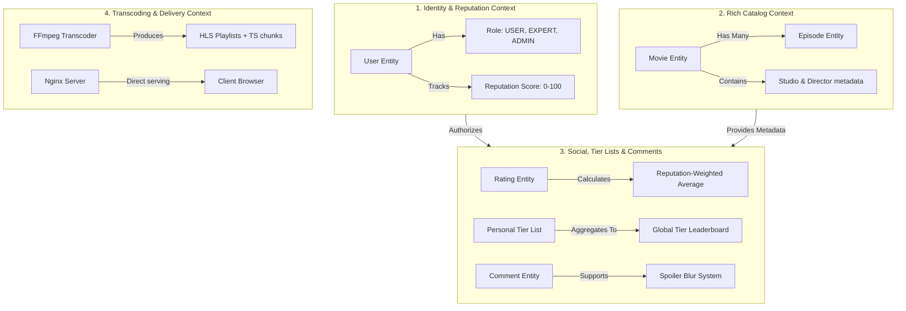
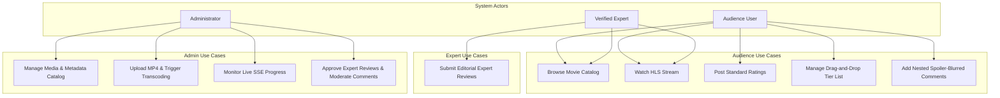
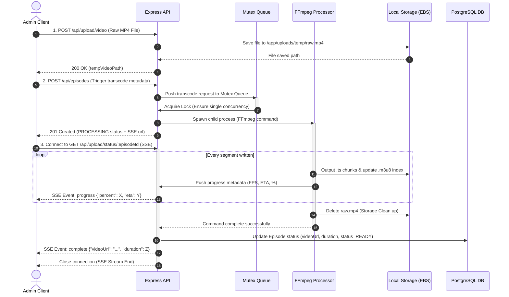
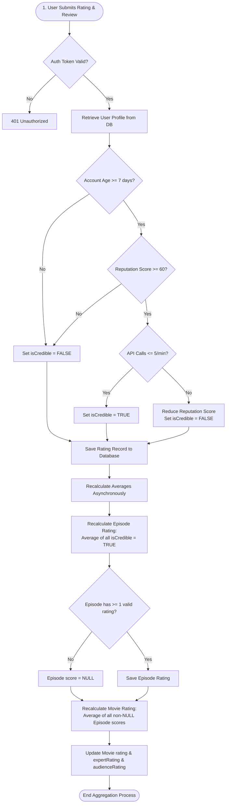

# Claude Spec-Driven Development: 01_system_spec

This document serves as the high-level **System Specification (01_system_spec)** for **Donghua3D**, complying with the Claude Spec-Driven Development (SDD) standard. It outlines system boundaries, scope, technology selections, bounded contexts, domain invariants, and security models.

---

## 1. System Identity & Scope

**Donghua3D** is an enterprise-grade, high-performance web streaming platform designed specifically for Chinese 3D Animation (Donghua). It is engineered for a curated collection of favorite series (20+ series initially, scaling up over time), featuring interactive personal and global rating systems, tier-list visualizers, dual-track expert/user reviews, and recursive comment sections.

### 1.1 Core Objectives
- **Pristine Playback**: Deliver high-fidelity, lag-free 1080p HLS streaming with immediate seeking capabilities.
- **Engaging Social Mechanics**: Provide drag-and-drop personal tier lists (S, A, B, C, D, F), mathematical anti-spam review aggregations, and nested spoiler-blurred comment threads.
- **Extreme Cost Efficiency**: Maintain a tiny operational footprint, allowing the MVP to run on an AWS EC2 instance costing $< \$20\text{/month}$ while maintaining an upgrade path to 10k+ concurrent users.

---

## 2. Technology Stack Selection

To maintain "mechanical sympathy" and avoid unnecessary abstractions, the technology stack is selected based on lightweight performance and developer velocity:

| Layer | Technology | Rationale |
| :--- | :--- | :--- |
| **Frontend** | Next.js (App Router, TS) | Standalone build target optimizes runtime footprint; server components optimize SEO and page-load times. |
| **Backend** | Express.js (TypeScript) | Lightweight, non-blocking asynchronous event loop; extremely low memory consumption (~50MB idle). |
| **Database ORM** | Prisma Client (TypeScript) | Eliminates runtime schema-drift; compiles down to a native Rust binary query engine for optimized queries. |
| **Database Engine** | PostgreSQL (v15+) | Relational integrity, native JSONB support, array indices, and highly reliable query optimization. |
| **Reverse Proxy / CDN** | Nginx & AWS CloudFront | Zero-copy media delivery via Nginx `sendfile()`; CloudFront edge caching reduces EC2 load. |
| **Video Engine** | FFmpeg (CLI) | Industry-standard codec processor for segmenting MP4 sources into stable, keyframe-aligned HLS chunks. |

---

## 3. Product Domain Model & Bounded Contexts

The domain of Donghua3D is partitioned into four decoupled Bounded Contexts. This ensures logical separation and a clear microservice separation pathway in the future:



### 3.1 Core Domain Invariants (Business Rules)
1. **The Sandbox Rule**: Accounts less than 7 days old or with a `reputationScore < 60` are marked as **Untrusted**. Their rating votes are stored for their personal display but are excluded from public/global scoring calculations.
2. **The Rating Cascade Rule**: If an episode has zero trusted rating votes, its rating score is marked as `NULL` and is excluded from the parent Movie's average rating calculation.
3. **The Uniqueness Rule**: A user can assign a movie to only one Tier bucket (`S`, `A`, `B`, `C`, `D`, `F`) at any given time.
4. **The Transcoding Mutex**: To protect the EC2 host from CPU starvation, only **one** FFmpeg transcoding job can run concurrently. Subsequent jobs are placed in a queue.

---

## 4. Threat Modeling & Security Specifications

### 4.1 Key Security Vulnerabilities & Mitigating Controls

#### 1. Video Segment Hijacking (Hotlinking)
- **Threat**: Attackers scrape `.ts` file links and redistribute them on unauthorized third-party sites, exhausting the server's egress bandwidth.
- **Mitigation (Phase 1)**: Nginx strict CORS policies restrict video resource loading to authorized domain headers.
- **Mitigation (Phase 4)**: AWS CloudFront Signed Cookies. S3 video buckets are private; video playback requires a short-lived cryptographic token generated by the Express API.

#### 2. SQL Injection / Data Corruption
- **Threat**: Attackers insert SQL queries into catalog search bars, nested comments, or rating reviews.
- **Mitigation**: Strict schema-driven type safety enforced via Prisma ORM. No raw SQL string concatenations.

#### 3. Review Bombing / Coordinated Rating Spam
- **Threat**: Bots or toxic users register mass accounts to coordinate negative spam ratings against a target movie/episode.
- **Mitigation**:
  - Accounts must be older than 7 days to affect the public score.
  - Submitting more than 5 ratings per minute drops account reputation instantly, setting `isCredible = false`.
  - Sudden surges in rating volume trigger **Lockdown**, automatically shifting reviews to "Pending Moderation" state.

#### 4. Server Exhaustion (DDoS on FFmpeg Pipeline)
- **Threat**: Compromised admin credentials or exploit routes trigger multiple heavy FFmpeg transcribing processes, freezing the host server.
- **Mitigation**: Strict JWT role-validation guards on all ingestion endpoints, combined with an active mutex locking queue ensuring a single concurrent encoding thread limit.

---

## 5. Architectural Diagrams & Core Workflows

To ensure absolute system clarity and accurate implementation alignment, this section details the system use cases, physical deployment tiers, and core sequence and activity flows.

### 5.1 System Use Cases & Roles Mapping

The system has three primary actors: standard audience users, verified experts, and system administrators. The diagram below maps their interactions with the system contexts.



---

### 5.2 Detailed Physical System Architecture

The following diagram maps the detailed network request boundaries, physical ports, container linkages, and host shared disk volume partitions of the single-instance monorepo (Phase 1).

```mermaid
graph TD
    subgraph ClientLayer [Client Layer]
        Browser[Client Browser / Video Player]
    end

    subgraph NetworkProxy [Edge & Routing Layer]
        Nginx{Nginx Reverse Proxy<br/>Port 80/443}
        SSL[Let's Encrypt SSL] --- Nginx
    end

    subgraph AppLayer [Application Layer - Docker Containers]
        NextJS[Next.js App Server<br/>Port 3000]
        Express[Express API Server<br/>Port 5000]
        PostgreSQL[(PostgreSQL Container<br/>Port 5432)]
    end

    subgraph DiskStorage [Local File Storage Volume]
        VolShared[/app/uploads]
        VolTemp[temp/] --- VolShared
        VolHLS[hls/] --- VolShared
        VolThumbs[thumbnails/] --- VolShared
    end

    Browser -->|HTTP/HTTPS| Nginx
    Nginx -->|/api/*| Express
    Nginx -->|/static/*| VolShared
    Nginx -->|/*| NextJS

    NextJS -->|REST Actions| Express
    Express -->|Prisma Client| PostgreSQL
    Express -->|Spawn Subprocess| FFmpeg[FFmpeg CLI Engine]

    FFmpeg -->|Read raw MP4| VolTemp
    FFmpeg -->|Write HLS segments| VolHLS
    FFmpeg -->|Extract thumbnail| VolThumbs
```

---

### 5.3 Asynchronous Video Transcoding Sequence (SSE Stream)

This sequence diagram illustrates the lifecycle of a video upload, starting from raw file writes, running through single-concurrency mutex locks, and transmitting real-time progress events back to the client.



---

### 5.4 Dual-Track Rating & Anti-Spam Recalculation Flow

This flowchart diagrams how incoming ratings are processed, evaluated against sandbox reputation parameters, flagged as untrusted if coordinated spam is detected, and how scores are cascaded and aggregated to update movie indices.



