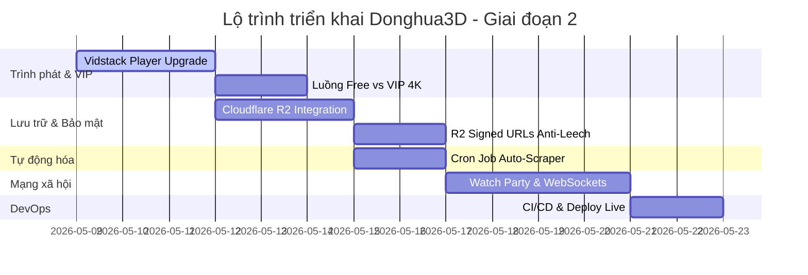

# Kế hoạch Triển khai Giai đoạn 2 (Phase 2 Implementation Plan) - Donghua3D
> **Tiêu chuẩn phát triển**: Spec-Driven Development (SDD) & Karpathy First-Principles  
> **Trọng tâm Giai đoạn 2**: Nâng cấp Trình phát Cao cấp, Hạ tầng 4K VIP Tự Host (Cloudflare R2) Chống Leech, Tương tác Thời gian thực (WebSockets), và Tự động hóa Vận hành.

---

## 📅 LỘ TRÌNH TRIỂN KHAI TỔNG QUAN

---

## 🛠️ CHI TIẾT TỪNG MILESTONE PHÁT TRIỂN

### 📽️ Milestone 1: Nâng cấp Trình phát Cao cấp (Vidstack Player & Multi-Quality)

Mục tiêu là mang lại một trải nghiệm phát video chuẩn cinematic cao cấp, rời bỏ các thành phần điều khiển mặc định, hỗ trợ tối đa việc chuyển đổi giữa các nguồn phát ngoài miễn phí và nguồn phát 4K chất lượng cao tự host.

#### **Tác vụ 1.1: Cài đặt và tích hợp Vidstack Core**
*   **Thư mục ảnh hưởng**: 
    *   `frontend/package.json`
    *   `frontend/src/app/movies/[id]/episodes/[episodeId]/page.tsx`
*   **Nội dung công việc**:
    *   Cài đặt thư viện `@vidstack/react` và `@vidstack/react/player/styles/...`.
    *   Thay thế thẻ `<video>` nguyên bản bằng cấu trúc `<MediaPlayer>` và `<MediaProvider>` của Vidstack.
*   **Tiêu chuẩn xác minh**: Trình duyệt nạp thành công Vidstack Player, không có lỗi runtime hiển thị trên Console.

#### **Tác vụ 1.2: Thiết kế Custom Controls (Tông Tím Neon & Glassmorphism)**
*   **Thư mục ảnh hưởng**:
    *   `frontend/src/components/VideoPlayer/CustomControls.tsx` (Tạo mới)
*   **Nội dung công việc**:
    *   Tự viết giao diện thanh điều khiển (Timeline scrubber, Play/Pause, Volume, Fullscreen) sử dụng Tailwind và CSS biến của Vidstack.
    *   Áp dụng hiệu ứng làm mờ kính cường lực (Glassmorphism), bóng mờ tím neon phản chiếu xung quanh nút bấm.
    *   Tích hợp lại phím tắt (Hotkeys) của hệ thống: `Space` (Play/Pause), `M` (Mute/Unmute), `F` (Fullscreen), các phím `Left/Right` để tua 5 giây mượt mà.
*   **Tiêu chuẩn xác minh**: Bấm thử phím tắt hoạt động chuẩn xác, thanh timeline di chuyển trơn tru, giao diện hover hiển thị sang trọng.

#### **Tác vụ 1.3: Module chuyển đổi luồng phát Free (CDN ngoài) vs VIP 4K (Cloudflare R2)**
*   **Thư mục ảnh hưởng**:
    *   `frontend/src/components/VideoPlayer/SourceSelector.tsx` (Tạo mới)
*   **Nội dung công việc**:
    *   Tích hợp menu chọn chất lượng luồng phát trực tiếp trong Player.
    *   Các luồng phát ngoài (Ophim CDN) được dán nhãn là **"Mặc định - Free"**.
    *   Luồng phát tự host trên R2 được dán nhãn là **"Ultra-HD 4K (VIP 👑)"**. Nếu người dùng có `Role === Role.USER` hoặc chưa đăng nhập, luồng này sẽ bị mờ đi và yêu cầu nâng cấp gói cước.
*   **Tiêu chuẩn xác minh**: Chuyển luồng mượt mà, người dùng không có tài khoản VIP không thể click chọn luồng phát 4K.

---

### ☁️ Milestone 2: Hạ tầng VIP 4K đám mây (Cloudflare R2 & Anti-Leech Protection)

Lưu trữ các siêu phẩm hoạt hình 3D định dạng Full HD / 4K tự transcode của riêng chúng ta một cách tiết kiệm chi phí nhất bằng Cloudflare R2 (Băng thông tải về miễn phí 100%), đồng thời bảo vệ tài nguyên số tránh bị leeching tràn lan.

#### **Tác vụ 2.1: Viết S3StorageService cho Cloudflare R2**
*   **Thư mục ảnh hưởng**:
    *   `backend/src/services/storage.service.ts`
*   **Nội dung công việc**:
    *   Tích hợp SDK `@aws-sdk/client-s3` vào backend.
    *   Cấu hình liên kết đến máy chủ Cloudflare R2 Bucket bằng R2 Access Key và Secret Key.
    *   Cung cấp API cho phép Admin upload file video phân đoạn `.ts` và file danh sách `.m3u8` trực tiếp từ Dashboard lên R2.
*   **Tiêu chuẩn xác minh**: File upload thành công lên Cloudflare R2 Dashboard và có thể truy cập được.

#### **Tác vụ 2.2: Tích hợp Token Kỹ thuật số Chống Leech (Signed URLs)**
*   **Thư mục ảnh hưởng**:
    *   `backend/src/controllers/movie.controller.ts`
    *   `backend/src/services/storage.service.ts`
*   **Nội dung công việc**:
    *   Mặc định, các file video 4K đắt giá trên Cloudflare R2 được đặt ở chế độ riêng tư (Private).
    *   Khi người dùng VIP gửi yêu cầu phát phim, backend sẽ sinh ra một **Cloudflare Signed URL** có mã hóa chữ ký số JWT đính kèm (hết hạn sau đúng 1 giờ).
    *   If người dùng khác sao chép (leech) link stream này dán ra ngoài, link sẽ ngay lập tức bị Cloudflare chặn đứng sau khi hết hạn, bảo toàn tuyệt đối tài nguyên băng thông máy chủ của chúng ta.
*   **Tiêu chuẩn xác minh**: Copy link phát dán sang trình duyệt ẩn danh sau 1 giờ và kiểm tra link bị trả về mã lỗi 401 Unauthorized.

---

### 🤖 Milestone 3: Tự động hóa Vận hành (Cron Job Auto-Scraper)

Loại bỏ hoàn toàn công việc vận hành thủ công của Admin bằng hệ thống chạy ngầm tự động đồng bộ phim mỗi ngày.

#### **Tác vụ 3.1: Lập lịch Cron Job ngầm định kỳ**
*   **Thư mục ảnh hưởng**:
    *   `backend/src/services/cron.service.ts` (Tạo mới)
    *   `backend/package.json`
*   **Nội dung công việc**:
    *   Cài đặt thư viện `node-cron` và `@types/node-cron`.
    *   Thiết lập một tác vụ chạy ngầm định kỳ (Cron Job) hoạt động vào lúc **0h00 hàng ngày** (`0 0 * * *`).
    *   Tự động gọi `scraperService.syncLatestHoathinh(1)` để đồng bộ các bộ hoạt hình mới cập nhật nhất từ trang nhất của đối tác về cơ sở dữ liệu hệ thống.
*   **Tiêu chuẩn xác minh**: Chạy thử cron với chu kỳ 1 phút để kiểm tra và xác nhận log ghi nhận cào phim thành công.

#### **Tác vụ 3.2: Ghi nhật ký cào phim (Scraping Logging & Dashboard)**
*   **Thư mục ảnh hưởng**:
    *   `backend/prisma/schema.prisma`
    *   `backend/src/services/scraper.service.ts`
*   **Nội dung công việc**:
    *   Tạo bảng `ScrapingLog` trong Prisma: lưu trữ thời gian cào, số lượng phim cập nhật thành công, số lượng lỗi và danh sách chi tiết các slug bị lỗi.
    *   Ghi lịch sử tự động mỗi khi cron job hoặc admin kích hoạt scraper.
*   **Tiêu chuẩn xác minh**: Bảng `ScrapingLog` được ghi nhận chính xác sau mỗi phiên cào phim.

---

### 💬 Milestone 4: Tương tác Mạng xã hội Thời gian thực (Watch Party & WebSockets)

Xây dựng cộng đồng người hâm mộ trung thành của Donghua3D bằng các tính năng tương tác mạng xã hội độc đáo thời gian thực.

#### **Tác vụ 4.1: Xây dựng WebSocket Gateway bằng Socket.io**
*   **Thư mục ảnh hưởng**:
    *   `backend/src/gateways/watchparty.gateway.ts` (Tạo mới)
    *   `backend/src/index.ts`
*   **Nội dung công việc**:
    *   Tích hợp thư viện Socket.io vào máy chủ Express.
    *   Xây dựng Gateway quản lý các kết nối thời gian thực của người dùng.
*   **Tiêu chuẩn xác minh**: Máy chủ kết nối Socket.io ổn định, không có xung đột cổng với REST API.

#### **Tác vụ 4.2: Tính năng Phòng xem chung (Watch Party Room)**
*   **Thư mục ảnh hưởng**:
    *   `frontend/src/app/watch-party/[roomId]/page.tsx` (Tạo mới)
*   **Nội dung công việc**:
    *   Cho phép người dùng tạo phòng xem chung phim hoạt hình và gửi link mời bạn bè.
    *   **Đồng bộ hóa trạng thái phát**: Khi chủ phòng bấm dừng (pause), tua nhanh (seek), hoặc phát tiếp (play), tất cả các thành viên trong phòng đều được đồng bộ hóa thời gian phát của video chính xác đến từng mili-giây.
    *   Tích hợp khung chat thời gian thực ngay bên cạnh trình chiếu.
*   **Tiêu chuẩn xác minh**: Mở hai cửa sổ trình duyệt xem chung một phim, bấm dừng ở tab 1, video ở tab 2 phải lập tức dừng theo.

---

### 🚀 Milestone 5: Quy trình Đóng gói & CI/CD tự động hóa Deployment

Thiết lập hạ tầng DevOps chuẩn công nghiệp để việc triển khai code lên máy chủ đám mây diễn ra tự động 100% khi có thay đổi trên GitHub.

#### **Tác vụ 5.1: Xây dựng GitHub Actions Pipeline**
*   **Thư mục ảnh hưởng**:
    *   `.github/workflows/deploy.yml` (Tạo mới)
*   **Nội dung công việc**:
    *   Tạo file workflow chạy khi có sự kiện `push` lên nhánh `nguyenvu` hoặc `main`.
    *   Thực hiện các bước:
        1.  Chạy linter quét mã nguồn.
        2.  Build thử nghiệm Next.js frontend và Express backend để bảo đảm không có lỗi TS.
        3.  Đóng gói Docker images và tự động push lên Docker Hub hoặc GitHub Container Registry.
        4.  Gửi lệnh SSH trực tiếp tới VPS/AWS EC2 chạy lệnh `docker-compose pull && docker-compose up -d` để khởi động phiên bản mới nhất trong mili-giây.
*   **Tiêu chuẩn xác minh**: Thực hiện đẩy code thử nghiệm và kiểm tra tiến trình GitHub Actions chạy hoàn chỉnh, website trên live server tự động cập nhật mà không bị mất kết nối (Zero-Downtime Deployment).

---
> **Bản kế hoạch triển khai được phê duyệt bởi Antigravity AI Technical Director.**  
> *Sẵn sàng bắt đầu Milestone 1 để chuyển đổi sang Vidstack Player cao cấp!*
