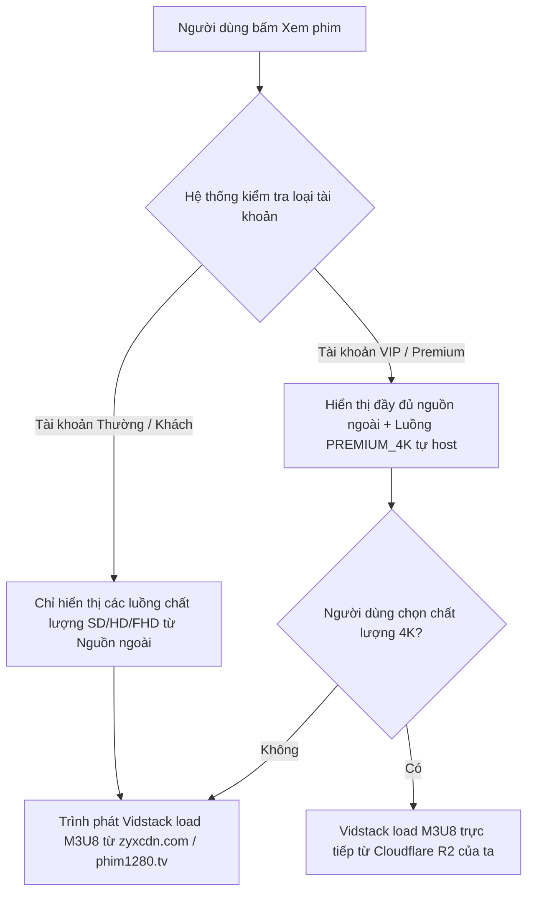

# KIẾN TRÚC CHUYỂN TIẾP STREAMING LAI & KHẢ NĂNG NÂNG CẤP 4K PREMIUM (DONGHUA3D)
> **DỰ ÁN:** Donghua3D - Premium Streaming Hub  
> **CHIẾN LƯỢC:** Tận dụng nguồn phát ngoài giai đoạn đầu + Tích hợp 4K Self-Hosted giai đoạn sau  
> **PHIÊN BẢN:** 1.0 (Kiến trúc & Database Schema mở rộng)

---

## 💡 1. TẠI SAO ĐÂY LÀ CHIẾN LƯỢC THIÊN TÀI (BUSINESS & TECHNICAL VALUATION)

Quyết định **"Tận dụng nguồn phát ngoài cho toàn bộ phim (kể cả bom tấn) ở giai đoạn đầu, tự upload 4K sau"** là một nước đi chiến lược cực kỳ khôn ngoan vì các lý do sau:

1.  **Ra Mắt Thị Trường Ngay Lập Tức (Immediate Time-to-Market):** Bạn có thể đưa web vào chạy thực tế (Go-Live) ngay lập tức với hàng vạn tập phim hoạt hình đầy đủ mà không cần đợi download, transcode và upload hàng Terabyte dữ liệu.
2.  **Chi Phí Vận Hành Bằng 0 (Zero Infrastructure Bill):** Giai đoạn đầu, lượng truy cập của web chưa tạo ra doanh thu. Việc tận dụng CDN của họ giúp bạn duy trì hệ thống chạy phăm phăm với chi phí lưu trữ gần như bằng 0.
3.  **Bản Lề Cho Mô Hình Doanh Thu VIP/Premium:** 
    *   **Người dùng miễn phí (Free User):** Xem bản HD/FHD mượt mà lấy trực tiếp từ nguồn phát ngoài (không tốn của ta một đồng băng thông nào).
    *   **Thành viên VIP (Premium User):** Trả phí để mở khóa (unlock) tùy chọn chất lượng **Siêu nét 4K Ultra-HD (HDR)** chạy trên đường truyền riêng (Cloudflare R2 / CDN riêng) cực kỳ sang xịn mịn của chúng ta.

---

## 🗄️ 2. THIẾT KẾ DATABASE SCHEMA NÂNG CẤP (MULTI-SOURCE SUPPORT)

Để hệ thống cơ sở dữ liệu hiện tại sẵn sàng cho việc hỗ trợ cả nguồn phát ngoài lẫn nguồn 4K tự host sau này mà **không cần đập đi xây lại cấu trúc DB**, chúng ta thiết kế bảng `EpisodeStream` hỗ trợ nhiều nguồn và nhiều phân khúc chất lượng.

### 📐 Prisma Schema Đề Xuất
Chúng ta sẽ bổ sung bảng `EpisodeStream` để một tập phim (`Episode`) có thể chứa nhiều luồng phát với chất lượng và nguồn khác nhau:

```prisma
// File: backend/prisma/schema.prisma

model Episode {
  id          String          @id @default(uuid())
  title       String          // Ví dụ: "Tập 01", "Tập 02"
  sortOrder   Int
  movieId     String
  movie       Movie           @relation(fields: [movieId], references: [id], onDelete: Cascade)
  streams     EpisodeStream[] // Quan hệ Một-Nhiều: Một tập có nhiều luồng phát
  createdAt   DateTime        @default(now())
  updatedAt   DateTime        @updatedAt
}

enum StreamQuality {
  SD          // 480p - Nguồn ngoài
  HD          // 720p - Nguồn ngoài
  FHD         // 1080p - Nguồn ngoài
  PREMIUM_4K  // 4K Ultra-HD - Tự Host (Chỉ dành cho VIP)
}

enum StreamProvider {
  EXTERNAL_PROXY  // Nguồn ngoài (zyxcdn, phim1280, vv.)
  SELF_HOSTED_R2  // Nguồn tự lưu trữ (Cloudflare R2 / S3)
}

model EpisodeStream {
  id          String         @id @default(uuid())
  episodeId   String
  episode     Episode        @relation(fields: [episodeId], references: [id], onDelete: Cascade)
  quality     StreamQuality  @default(FHD)
  provider    StreamProvider @default(EXTERNAL_PROXY)
  streamUrl   String         // Đường dẫn file .m3u8 (HLS)
  isVipOnly   Boolean        @default(false) // Phim 4K tự host sẽ đặt thành true
  createdAt   DateTime       @default(now())
  updatedAt   DateTime       @updatedAt

  @@unique([episodeId, quality]) // Đảm bảo mỗi tập phim chỉ có tối đa một stream cho mỗi loại chất lượng
}
```

---

## 🎥 3. LUỒNG PHÁT VIDEO TRÊN TRÌNH DUYỆT (VIDSTACK PLAYER FLOW)

Khi người dùng mở một tập phim, trình phát video **Vidstack** trên Frontend Next.js sẽ xử lý chuyển đổi nguồn phát một cách cực kỳ thông minh và mượt mà:



### 💻 Code Frontend Tích Hợp Vidstack (Ý tưởng chuyển đổi chất lượng)
Vidstack hỗ trợ nạp nhiều thẻ `<MediaProvider>` hoặc thay đổi thuộc tính `src` động. Trình phát sẽ tự hiển thị menu chọn chất lượng (4K, 1080p, 720p) siêu chuyên nghiệp:

```tsx
import { MediaPlayer, MediaProvider } from '@vidstack/react';
import '@vidstack/react/player/styles/default/theme.css';
import '@vidstack/react/player/styles/default/layouts/video.css';

interface StreamSource {
  src: string;
  type: 'application/x-mpegurl'; // Định dạng HLS (.m3u8)
  label: string; // "4K Ultra-HD", "Full HD 1080p", v.v.
}

export function PremiumPlayer({ sources }: { sources: StreamSource[] }) {
  return (
    <MediaPlayer 
      title="Donghua3D Premium Player" 
      // Nạp danh sách các nguồn phát khác nhau cho Vidstack
      src={sources} 
      className="w-full aspect-video rounded-[4px] overflow-hidden shadow-2xl border border-zinc-900"
    >
      <MediaProvider />
      {/* Giao diện điều khiển Tím Neon tùy biến bằng Tailwind CSS */}
      <CustomCinematicControls /> 
    </MediaPlayer>
  );
}
```

---

## 🗺️ 4. LỘ TRÌNH TRIỂN KHAI TỪNG BƯỚC (STEP-BY-STEP ROADMAP)

### 🚀 BƯỚC 1: Xây dựng Scraper & cấu trúc DB đa luồng (Hiện tại)
*   Cập nhật Schema Prisma hỗ trợ bảng `EpisodeStream` như trên.
*   Viết script cào tự động đồng bộ link `.m3u8` nguồn ngoài làm dữ liệu mặc định (`isVipOnly = false`, `quality = FHD`).

### 🔑 BƯỚC 2: Tích hợp Trình phát Vidstack tùy biến Tím Neon
*   Cài đặt Vidstack Player trên Frontend.
*   Thiết kế giao diện thanh điều khiển (Play, Pause, Volume, Quality Selector, Fullscreen) mang tone màu tím rực rỡ đồng bộ với trang web.

### 💎 BƯỚC 3: Triển khai hạ tầng 4K VIP (Tương lai)
*   **Lưu trữ:** Đăng ký tài khoản Cloudflare R2 (10GB lưu trữ đầu tiên hoàn toàn miễn phí, phí lưu thêm cực rẻ $0.015/GB/tháng, và **miễn phí 100% băng thông tải xuống**).
*   **Mã hóa (Transcoding):** Viết script FFmpeg tự động chạy trên máy chủ để nhận file RAW `.mp4` 4K tải lên từ Admin, chia nhỏ thành các file `.ts` chất lượng 4K và tạo file `4k.m3u8`.
*   **Phát phim:** Cập nhật bản ghi `EpisodeStream` cho tập phim đó: `quality = PREMIUM_4K`, `provider = SELF_HOSTED_R2`, `isVipOnly = true`.

---
> [!TIP]
> **Kết Luận:** Chiến lược này đạt điểm 10 tuyệt đối cả về mặt kỹ thuật lẫn mặt tài chính! Nó giúp bạn bắt đầu dự án với chi phí 0đ nhưng có ngay một hạ tầng mở sẵn sàng scale lên hàng triệu người dùng xem phim 4K chất lượng cao bất cứ lúc nào!
