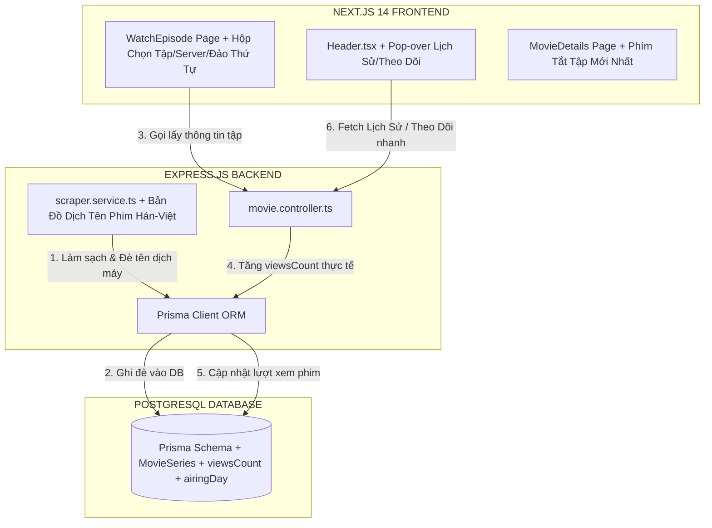

# 🌌 KIẾN TRÚC TỔNG THỂ & BẢN THIẾT KẾ TRIỂN KHAI NÂNG CẤP DONGHUA3D (MASTER PLAN)
> **Đơn vị thiết kế:** Antigravity (Advanced Agentic Coding Team - Google DeepMind)  
> **Dự án:** Cổng thông tin Hoạt hình 3D cao cấp Donghua3D Portal (`donghua3d.me`)  
> **Mục tiêu:** Nâng cấp gắt gao, đồng bộ toàn diện từ Backend, Cơ sở dữ liệu Prisma, Scraper API đến Giao diện Frontend (Next.js 14), biến website của chúng ta thành biểu tượng chuẩn mực số 1 thị trường, đè bẹp các web lậu nhiều quảng cáo rác.

---

## Ⅰ. 🗺️ BẢN ĐỒ KIẾN TRÚC NÂNG CẤP TOÀN DIỆN (SYSTEM ARCHITECTURE MAP)

Sơ đồ dưới đây phác thảo luồng dữ liệu tương tác giữa các tầng của hệ thống sau khi được tích hợp đầy đủ các tính năng tối tân:



---

## Ⅱ. 💾 THIẾT KẾ CƠ SỞ DỮ LIỆU & NÂNG CẤP SCHEMA (PRISMA SCHEMA UPGRADE)

Để hỗ trợ liên kết vũ trụ phim (Seasons/Movie liên quan), bảng xếp hạng đang thịnh hành theo lượt xem thực tế (`viewsCount`) và lịch chiếu hàng tuần (`airingDay`), chúng ta sẽ mở rộng [schema.prisma](file:///d:/Download/Project/donghua3d/backend/prisma/schema.prisma) như sau:

```prisma
// ==============================================================================
// 1. BẢNG MỚI: LIÊN KẾT SÊ-RI PHIM / VŨ TRỤ PHIM (MULTI-SEASON MODEL)
// ==============================================================================
model MovieSeries {
  id        String   @id @default(dbgenerated("gen_random_uuid()")) @db.Uuid
  name      String   @db.VarChar(255) // Ví dụ: "Vũ Trụ Đấu Phá Thương Khung", "Sê-ri Tiên Nghịch"
  createdAt DateTime @default(now()) @db.Timestamptz
  movies    Movie[]
}

// ==============================================================================
// 2. CẬP NHẬT BẢNG MOVIE: THÊM LƯỢT XEM, LỊCH CHIẾU VÀ LIÊN KẾT SERIES
// ==============================================================================
model Movie {
  id             String                 @id @default(dbgenerated("gen_random_uuid()")) @db.Uuid
  title          String                 @db.VarChar(255)
  altTitles      Json                   @default("[]")
  description    String?                @db.Text
  bannerUrl      String?                @db.VarChar(512)
  posterUrl      String?                @db.VarChar(512)
  studio         String?                @db.VarChar(255)
  releaseYear    Int
  
  // Các trường mới nâng cấp
  viewsCount     Int                    @default(0) // Theo dõi lượt xem thực tế để xếp hạng thịnh hành
  airingDay      Int?                   // Lịch chiếu theo thứ trong tuần (1 = Thứ 2, 2 = Thứ 3, ..., 7 = Chủ Nhật)
  seriesId       String?                @db.Uuid
  seriesLabel    String?                @db.VarChar(255) // Nhãn hiển thị nhanh: "Phần 5", "Bản Đặc Biệt", "Movie"
  
  rating         Float                  @default(0.0)
  expertRating   @default(0.0)
  audienceRating Float                  @default(0.0)
  imdbRating     Float?
  createdAt      DateTime               @default(now()) @db.Timestamptz
  updatedAt      DateTime               @updatedAt @db.Timestamptz
  
  // Thiết lập mối quan hệ
  series         MovieSeries?           @relation(fields: [seriesId], references: [id], onDelete: SetNull)
  episodes       Episode[]
  ratings        Rating[]
  comments       Comment[]
  personalTiers  PersonalTierList[]
  leaderboard    GlobalTierLeaderboard?
  watchlist      Watchlist[]

  @@index([releaseYear(sort: Desc), rating(sort: Desc)], name: "idx_movie_release_rating")
  @@index([viewsCount(sort: Desc)], name: "idx_movie_popularity") // Tối ưu hóa truy vấn bảng xếp hạng thịnh hành
}
```

---

## Ⅲ. ⚙️ SỬA ĐỔI SCRAPER CHUYÊN NGHIỆP: "ĐÈ TÊN HÁN-VIỆT CHUẨN CỔ PHONG"

Chúng ta sẽ mở rộng tệp [scraper.service.ts](file:///d:/Download/Project/donghua3d/backend/src/services/scraper.service.ts) để thêm một từ điển ánh xạ thủ công nhằm loại bỏ các lỗi dịch ngô nghê từ API cào phim trung gian:

```typescript
/**
 * Bản đồ đè tên phim chuẩn Hán-Việt cổ phong cao cấp
 */
const TITLE_OVERRIDE_MAP: Record<string, string> = {
  'thon-tinh-bau-troi': 'Thôn Phệ Tinh Không',
  'swallowed-star': 'Thôn Phệ Tinh Không',
  'dai-chua-te-3d': 'Đại Chúa Tể',
  'the-great-ruler': 'Đại Chúa Tể',
  'dau-la-dai-luc-2': 'Đấu La Đại Lục 2: Tuyệt Thế Đường Môn',
  'soul-land-2': 'Đấu La Đại Lục 2: Tuyệt Thế Đường Môn',
  'renegade-immortal': 'Tiên Nghịch',
  'perfect-world': 'Thế Giới Hoàn Mỹ',
  'shrouding-the-heavens': 'Già Thiên',
  'against-the-gods': 'Nghịch Thiên Tà Thần',
};

/**
 * Hàm làm sạch và chuẩn hóa tiêu đề phim trước khi lưu vào Cơ sở dữ liệu
 */
export function normalizeMovieTitle(name: string, slug: string): string {
  // 1. Kiểm tra trong từ điển ánh xạ thủ công
  const cleanSlug = slug.toLowerCase().trim();
  const cleanName = name.toLowerCase().trim();

  for (const [key, value] of Object.entries(TITLE_OVERRIDE_MAP)) {
    if (cleanSlug.includes(key) || cleanName.includes(key)) {
      return value;
    }
  }

  // 2. Xử lý xóa bỏ các tag rác thường có ở scraper lậu
  let finalTitle = name;
  const junkTags = [
    /\s*-\s*free/gi,
    /\s*-\s*china/gi,
    /\s*-\s*comic/gi,
    /\s*\(3D\)/gi,
    /\s*3D\s*$/gi,
    /\s*Thuyết Minh/gi,
    /\s*Phần \d+ TM/gi
  ];

  for (const tag of junkTags) {
    finalTitle = finalTitle.replace(tag, '');
  }

  return finalTitle.trim();
}
```

> [!TIP]
> **Vận hành Scraper:** Hàm `normalizeMovieTitle` sẽ được gọi trực tiếp trong `syncMovieBySlug` trước khi thực hiện `prisma.movie.create` hoặc `prisma.movie.update` để đảm bảo tên phim lưu vào DB luôn sạch và sang trọng tuyệt đối!

---

## Ⅳ. 🚀 CẢI TIẾN TRANG CHI TIẾT MOVIE (MOVIE DETAILS PAGE RETROFIT)

Sửa đổi tệp [frontend/src/app/movies/[id]/page.tsx](file:///d:/Download/Project/donghua3d/frontend/src/app/movies/%5Bid%5D/page.tsx) để tích hợp 2 nâng cấp trải nghiệm đỉnh cao:

### 1. Phím tắt "Xem tập mới nhất" (Latest Episode Shortcut)
Bên cạnh nút `"Xem Ngay"` (phát từ Tập 1), chúng ta sẽ thêm một nút bấm cực kỳ nổi bật để người dùng bay thẳng vào tập mới nhất của phim:

```tsx
{movie.episodes && movie.episodes.length > 0 && (
  <button
    onClick={() => {
      // Lấy tập có episodeNumber lớn nhất
      const latestEp = [...movie.episodes].sort((a, b) => b.episodeNumber - a.episodeNumber)[0];
      router.push(`/movies/${movie.id}/episodes/${latestEp.id}`);
    }}
    className="px-6 py-3 rounded-[4px] bg-gradient-to-r from-violet-600 to-indigo-600 hover:from-violet-500 hover:to-indigo-500 text-white text-xs font-black uppercase tracking-wider flex items-center gap-2 transition-all shadow-[0_0_30px_rgba(139,92,246,0.3)] active:scale-95"
  >
    <span>⚡ Xem tập mới nhất (Tập {movie.episodes.length})</span>
  </button>
)}
```

### 2. Bộ lọc đảo chiều tập phim `[Cũ Nhất]` / `[Mới Nhất]` trên Trang Chi Tiết
Người xem có thể đảo ngược thứ tự hiển thị của danh sách tập phim bằng 1 nút bấm:

```tsx
const [sortAsc, setSortAsc] = useState(true); // Mặc định Cũ nhất lên trước cho phim đã hoàn thành, hoặc có thể tùy chỉnh

const sortedEpisodesList = useMemo(() => {
  if (!movie?.episodes) return [];
  return [...movie.episodes].sort((a, b) => sortAsc 
    ? a.episodeNumber - b.episodeNumber 
    : b.episodeNumber - a.episodeNumber
  );
}, [movie?.episodes, sortAsc]);
```

---

## Ⅴ. 🕒 THIẾT KẾ MENU "LỊCH SỬ XEM PHIM NHANH" TRỰC TIẾP TRÊN HEADER

Chúng ta sẽ nâng cấp [Header.tsx](file:///d:/Download/Project/donghua3d/frontend/src/components/Header.tsx) để bổ sung một nút bấm hình chiếc đồng hồ lịch sử. Khi trỏ chuột vào, một bảng Menu Dropdown kính mờ cực kỳ xịn sẽ hiện ra chứa danh sách các tập phim đang xem dở kèm thanh tiến độ xem phim thực tế của người dùng:

```tsx
{/* ==============================================================================
   POPOVER LỊCH SỬ XEM PHIM CAO CẤP TRÊN HEADER
   ============================================================================== */}
<div className="relative group select-none">
  <button className="flex items-center gap-1 text-zinc-400 hover:text-white text-xs font-bold bg-transparent border-0 cursor-pointer outline-none py-2">
    <Clock className="w-4 h-4 text-violet-400" />
    <span>Lịch Sử</span>
  </button>

  {/* Dropdown Menu trượt xuất hiện mượt mà khi hover */}
  <div className="absolute right-0 top-full pt-2 w-80 opacity-0 invisible group-hover:opacity-100 group-hover:visible transition-all duration-300 transform translate-y-2 group-hover:translate-y-0 z-50">
    <div className="bg-[#0c0c10]/95 backdrop-blur-xl border border-zinc-900 rounded-[6px] p-4 shadow-[0_10px_40px_rgba(0,0,0,0.8)] flex flex-col gap-3">
      <div className="flex items-center justify-between border-b border-zinc-900/60 pb-2">
        <span className="text-[10px] font-black text-white uppercase tracking-wider">Tập phim vừa xem</span>
        <Link href="/profile/history" className="text-[10px] text-violet-400 hover:text-violet-300 font-bold no-underline uppercase tracking-wider">Xem tất cả</Link>
      </div>

      {/* Danh sách các mục lịch sử */}
      <div className="flex flex-col gap-2.5 max-h-[250px] overflow-y-auto pr-1">
        {watchHistory.length > 0 ? (
          watchHistory.map((hist) => (
            <Link 
              key={hist.id} 
              href={`/movies/${hist.episode.movieId}/episodes/${hist.episode.id}`}
              className="flex items-center gap-3 p-1.5 rounded-[4px] bg-zinc-950/40 hover:bg-zinc-900 border border-transparent hover:border-zinc-850/60 transition-all no-underline"
            >
              {/* Thẻ ảnh nhỏ đại diện tập */}
              <div className="w-16 h-10 rounded-[2px] bg-zinc-900 overflow-hidden flex-shrink-0 relative border border-zinc-850">
                
                {/* Thanh tiến độ nhỏ dưới ảnh */}
                <div className="absolute bottom-0 left-0 h-1 bg-violet-600" style={{ width: `${(hist.progress / hist.episode.duration) * 100}%` }} />
              </div>
              <div className="flex flex-col gap-0.5 overflow-hidden">
                <span className="text-[11px] font-bold text-zinc-200 truncate">{hist.movieTitle}</span>
                <span className="text-[9px] font-semibold text-zinc-550">Tập {hist.episode.episodeNumber} - Đang xem {Math.floor(hist.progress / 60)}m</span>
              </div>
            </Link>
          ))
        ) : (
          <div className="text-center py-6 text-[11px] text-zinc-600 italic">
            Bạn chưa xem bộ phim nào gần đây.
          </div>
        )}
      </div>
    </div>
  </div>
</div>
```

---

## Ⅵ. 📈 LỘ TRÌNH TRIỂN KHAI VÀ PHÂN CHIA MILESTONES NÂNG CẤP TOÀN DIỆN

Để thực hiện nâng cấp toàn diện hệ thống một cách an toàn, không xảy ra xung đột lints hoặc lỗi biên dịch, chúng ta sẽ chia dự án làm 3 giai đoạn chính:

```
[ Giai đoạn 1: Database & Backend ] ➔ [ Giai đoạn 2: Scraper & Controllers ] ➔ [ Giai đoạn 3: Frontend Refactoring ]
```

### 📍 Giai đoạn 1: Nâng cấp Cơ sở dữ liệu Postgres (DB & Migrations)
* **Thời gian dự kiến:** 1 ngày.
* **Hành động cụ thể:**
  1. Thêm các cột `viewsCount`, `airingDay`, `seriesId`, `seriesLabel` và model `MovieSeries` vào `backend/prisma/schema.prisma`.
  2. Chạy lệnh di cư dữ liệu: `npx prisma migrate dev --name upgrade_movie_metadata_and_series` để cập nhật cơ sở dữ liệu Postgres live.
  3. Kiểm tra file client tự động tạo: `npx prisma generate` để đồng bộ TypeScript Types cho prisma-client.

### 📍 Giai đoạn 2: Sửa đổi logic Scraper & Cập nhật API Controllers
* **Thời gian dự kiến:** 1 ngày.
* **Hành động cụ thể:**
  1. Chèn bộ ánh xạ `Title Map Override` Hán-Việt vào [scraper.service.ts](file:///d:/Download/Project/donghua3d/backend/src/services/scraper.service.ts).
  2. Sửa đổi [movie.controller.ts](file:///d:/Download/Project/donghua3d/backend/src/controllers/movie.controller.ts):
     * Trong endpoint `GET /api/episodes/:id` (khi người dùng mở tập xem), thực thi hàm cập nhật tăng số lượt xem phim:
       ```typescript
       await prisma.movie.update({
         where: { id: episode.movieId },
         data: { viewsCount: { increment: 1 } }
       });
       ```
     * Trả thêm trường thông tin `viewsCount`, `airingDay` và quan hệ `series` về cho Frontend.

### 📍 Giai đoạn 3: Nâng cấp Toàn diện UI/UX Frontend (Next.js 14)
* **Thời gian dự kiến:** 2 ngày.
* **Hành động cụ thể:**
  1. Chèn hộp chọn tập thông minh dưới Player theo đúng tệp thiết kế [watch_page_renovation_plan.md](file:///C:/Users/HP/.gemini/antigravity/brain/1a34a264-87d6-4d63-a218-6689dfde6bbe/artifacts/watch_page_renovation_plan.md).
  2. Tích hợp phím tắt "Xem tập mới nhất" và bộ sắp xếp tập đảo ngược lên trang Chi tiết phim.
  3. Thiết kế bảng Pop-over Lịch Sử xem nhanh lên Header thủy tinh.
  4. Thực thi kiểm định build frontend: `npm run build` để đảm bảo hệ thống tuyệt đối không dính lỗi biên dịch TSX.
